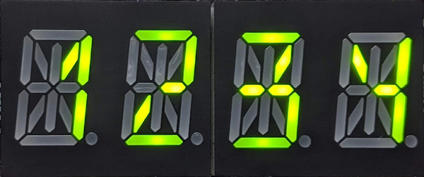
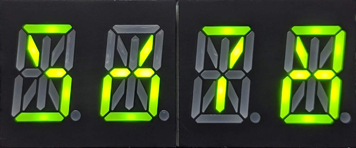
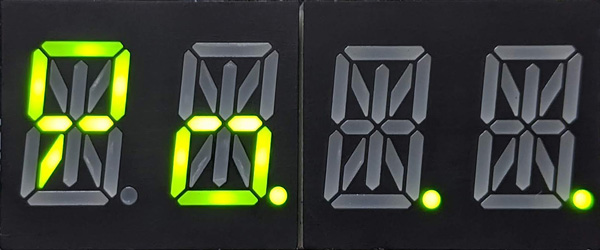
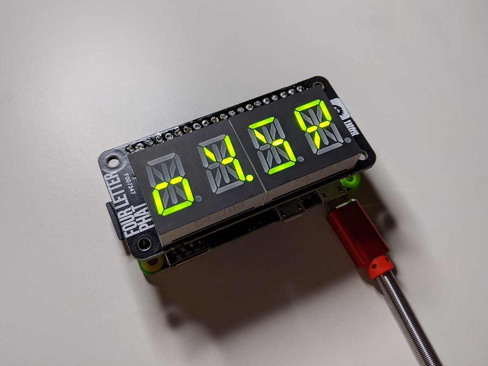

# Number style for 14-segment display 





## Implementation

### Pimoroni Four Letter pHAT



- [Official website](https://shop.pimoroni.com/products/four-letter-phat)
- [Python library](https://github.com/pimoroni/fourletter-phat)

```python
import fourletterphat
from fourletterphat.alphanum4 import DIGIT_VALUES

# Override bitmask definitions:
DIGIT_VALUES["0"] = 0b0000000011011100
DIGIT_VALUES["1"] = 0b0000010000000110
DIGIT_VALUES["2"] = 0b0000100010001011
DIGIT_VALUES["3"] = 0b0000010011001101
DIGIT_VALUES["4"] = 0b0000000110000110
DIGIT_VALUES["5"] = 0b0000000110001101
DIGIT_VALUES["6"] = 0b0000010011011100
DIGIT_VALUES["7"] = 0b0001010000000001
DIGIT_VALUES["8"] = 0b0000000111011111
DIGIT_VALUES["9"] = 0b0000100011100011
```

## Designer

Xoihazard ([xoihazard.com](https://xoihazard.com))